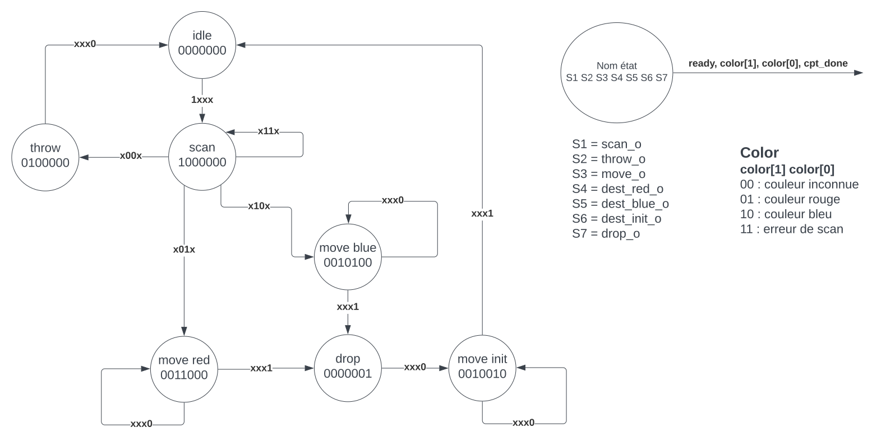
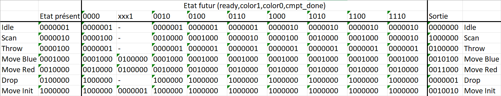

# SYL_Labo4

## Machine d'état

### Analyse des entrées

Le circuit original comprend les entrées `ready_i`, `color_i`, `clk_i` et `reset_i`.
- `ready_i` : Arrive seulement lorsque le bras est en position initiale pour dire qu'il peut procéder au scan d'une boîte. 
- `color_i` : Arrive une fois qu'un scan a été effectué et défini la couleur de la boîte.
  - 00 : Couleur indéterminé
  - 01 : Rouge
  - 10 : Bleu
  - 11 : Erreur
- `clk_i` : Horloge
- `reset_i` : Reset asynchrone de tout le système.

Ces entrées à elles seules ne nous permettent pas de faire tous les changements d'états de la façon demandée. Pour ça il nous faudra une entrée supplémentaire `compteur_done` qui servira à nous dire si le bras à fini de se déplacer car celui-ci prend 3 coups d'horloge pour se déplacer.
Cette entrée fonctionne en utilisant un décompteur qui renvoi `1` quand il arrive à `0`.

### Analyse des sorties

Les sorties correspondent simplement à la prochaine chose à faire soit au prochain état de la machine.
- `scan_o` : 1 quand la prochaine chose à faire c'est scanner une pièce
- `throw_o` : 1 quand le scan à rendu la valeur 00 donc une couleur indéterminé
- `move_o` : 1 quand le bras doit se déplacer, sera à 1 en même temps que la sortie définissant où il doit aller
- `dest_red_o` : 1 en même temps que `move_o` pour se déplacer à la zone rouge
- `dest_blue_o` : 1 en même temps que `move_o` pour se déplacer à la zone bleu
- `dest_init_o` : 1 en même temps que `move_o` pour se déplacer à la zone initiale
- `drop_o` : 1 quand le bras arrive en zone bleu/rouge et va devoir lacher la pièce tenue

Le bras étant une machine d'état séquenciel de MOORE, les sorties dépendent uniquement de l'état actuel et non pas des entrées.

### Graphe des états
Le graphe d'état correspondant à notre machine est la suivante:

### Table des états
Voici la table des états correspondant au graphe ci-dessus:

### Création des équations
Pour la création des équation nous nous sommes basé sur la table des états. La machine étant MOORE, les sorties sont facile à définir selon l'état actuel surtout puisque nous avons utilisé la notation 1 parmi M qui nous permet de regarder qu'un seul bit de l'état pour définir chaque sortie.

#### Sorties

#### Etats Futurs
$$idle^+ = idle * \overline{ready} + throw + moveInit * done$$
scan+ = idle.ready + scan.color1.color2
throw+ = scan./color1./color2
moveBlue+ = scan.color1./color2 + moveBlue./done
moveRed+ = scan./color1.color2 + moveRed./done
drop+ = moveBlue.done + moveRed.done
moveInit+ = drop + moveInit./done